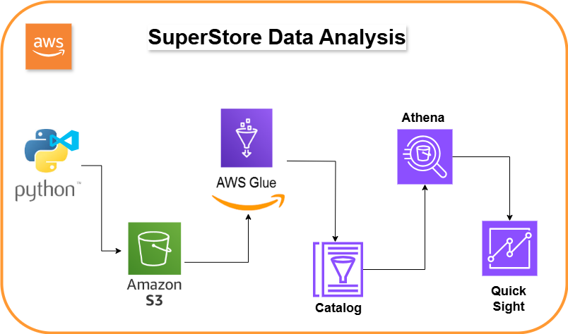

# Glue-Athena-QuickSight Data Analytics Pipeline

## Project Diagram

## Project Overview
This project shows how to build a complete data analytics system using AWS services. It processes, analyzes, and visualizes data seamlessly with Python, AWS S3, AWS Glue, AWS Athena, and AWS QuickSight.

## Workflow
Prepare Data with Python
Raw data is cleaned and uploaded to Amazon S3 for storage using Python.

## Transform Data with AWS Glue
AWS Glue creates ETL (Extract, Transform, Load) scripts to clean and organize the data for analysis.

## Catalog Data with AWS Glue Data Catalog
Transformed data is stored in the AWS Glue Data Catalog for easy access by Athena.

## Query Data with AWS Athena
AWS Athena runs SQL-like queries on the processed data stored in S3.

## Visualize Data with AWS QuickSight
Athena query results are visualized using AWS QuickSight to create dashboards and reports.

## Key Features
Automatic data cleaning and organization with AWS Glue.
Easy querying with AWS Athena (no server management needed).
Interactive and scalable dashboards in AWS QuickSight.

## Benefits
Fully serverless and highly scalable system.
Cost-effective tools for analyzing and visualizing data.
Quick access to insights with minimal manual effort.
Note: Add your diagram by replacing path/to/your/image.png with the correct file path or URL.
